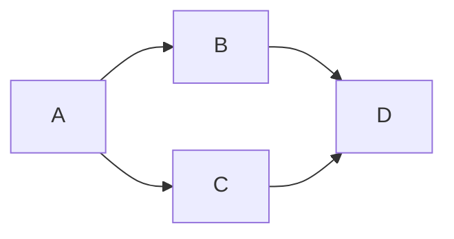

# backend-comision-1-2023-argentina-programa-4.0
Desafíos y ejercicios. Construcción de aplicaciones de servidor (back-end). Creación de servicios web que proveen datos a aplicaciones web front-end, aplicaciones de escritorio como también aplicaciones móviles. Creación y administración de bases de datos SQL y noSQL, e integradas éstas a los servicios web.


<!-- Clase sobre Documentación y Lenguaje Markdown -->

<!-- # Título de primer nivel (encabezado 1)
## Título de primer nivel (encabezado 2)
### Título de primer nivel (encabezado 3)
#### Título de primer nivel (encabezado 4)
##### Título de primer nivel (encabezado 5)
###### Título de primer nivel (encabezado 6) -->


<!-- **Texto en negrita** pero seguimos redactando información para nuestra ***aplicación***.

*Texto en negrita*

***Texto en negrita*** -->

<!-- ~~Texto Tachado~~

<u>Texto Subrayado</u> -->

<!-- > Esto es una cita dentro del bloque de texto breve. Y podemos seguir colocando mas texto. -->

<!-- - [x] Tarea 1
- [x] Tarea 2
- [ ] Tarea 3  -->


<!-- 
  | Petición                            | URL                                    | Descripción |
  | :----: | ----------------------------------- | -------------------------------------- |
  | GET  | `http://localhost:3008/frutas`      | Obtener todas las frutas               |
  | GET  | `http://localhost:3008/frutas/{id}` | Obtener una fruta específica por su ID |
  | POST | `http://localhost:3008/frutas`      | Grabar una nueva fruta                                        |                                        |
 -->


<!-- ```js
    let numero = 1;
    let mensaje = "Hola, mundo!";
``` -->

<!-- 

[Aprendiendo Mongo](https://www.mongodb.com/es)

[](https://www.mongodb.com/es)  -->


<!-- 1 [CRUD](#crud)
   
1.1 [Create](#create)

1.2 [Read](#read)

1.3 [Update](#update)

1.4 [Delete](#delete)

# CRUD

### API de Frutas - Documentación de Peticiones.

Esta documentación describe las peticiones de creación (create), lectura (read), actualización (update) y eliminación (delete) disponibles en la API de Frutas. Estas peticiones permiten interactuar con elementos existentes en la API, como registros o recursos.

### Requisitos previos

Antes de realizar peticiones de creación, asegúrate de tener la siguiente información y configuración:

- Acceso a la URL base de la API: `http://localhost:3008`
- Credenciales de autenticación, si es necesario.
- Conocimiento de los campos y formatos requeridos para crear un elemento en la API.

## Create

### Peticiones disponibles

A continuación se presentan las peticiones de creación disponibles en la API de frutas:

### Crear un nuevo registro

- **Descripción:** Crea un nuevo registro en la base de datos.
- **URL:** `https://localhost:3008/frutas`
- **Método:** POST
- **Cuerpo de la petición:** Debes proporcionar los datos necesarios en el cuerpo de la petición en formato JSON. Asegúrate de incluir todos los campos requeridos para crear un registro.

Ejemplo de cuerpo de la petición:
```json
{
    "id": 1,
    "imagen": "🍌",
    "nombre": "Bananas",
    "importe": 220,
    "stock": 50
  }
```

- **Respuesta exitosa:** La petición devuelve un código de estado 201 (Created) y la respuesta contiene los detalles del nuevo registro creado.

- **Respuesta de error:** Si la petición falla, se devolverá un código de estado apropiado (por ejemplo, 400 para errores de validación) y la respuesta contendrá información adicional sobre el error.

### Notas adicionales

- Asegúrate de cumplir con los requisitos de autenticación, si es necesario, para realizar peticiones de creación.
- Verifica los campos requeridos y los formatos esperados en la documentación de la API para cada tipo de elemento que desees crear.
- Utiliza las respuestas de error para identificar y solucionar problemas en caso de que la petición de creación falle.

## Read

## Peticiones disponibles

A continuación se presentan las peticiones de lectura, en la API de Frutas:

### Leer un registro

- **Descripción:** Obtiene los detalles de un registro específico.
- **URL:** `http://localhost:3008/frutas/{id}`
- **Método:** GET
- **Parámetros de la petición:** Reemplaza `{id}` en la URL con el identificador del registro que deseas obtener.

- **Respuesta exitosa:** La petición devuelve un código de estado 200 (OK) y la respuesta contiene los detalles del registro solicitado.

- **Respuesta de error:** Si la petición falla o el registro no existe, se devolverá un código de estado apropiado (por ejemplo, 404 si el registro no se encuentra) y la respuesta contendrá información adicional sobre el error.

## Update

### Actualizar un recurso

- **Descripción:** Actualiza los detalles de un recurso existente en la API.
- **URL:** `http://localhost:3008/frutas/{id}`
- **Método:** PUT
- **Parámetros de la petición:** Reemplaza `{id}` en la URL con el identificador del objeto que deseas actualizar.

- **Cuerpo de la petición:** Debes proporcionar los nuevos datos del objeto en el cuerpo de la petición en formato JSON. Asegúrate de incluir todos los campos requeridos para la actualización.

Ejemplo de cuerpo de la petición:
```json
{
    "id": 1,
    "imagen": "🍌",
    "nombre": "Bananas",
    "importe": 220,
    "stock": 50
  }
```

- **Respuesta exitosa:** La petición devuelve un código de estado 200 (OK) y la respuesta contiene los detalles actualizados del objeto.

- **Respuesta de error:** Si la petición falla, se devolverá un código de estado apropiado (por ejemplo, 400 para errores de validación) y la respuesta contendrá información adicional sobre el error.

## Delete

### Eliminar un registro

- **Descripción:** Elimina un registro existente de la base de datos.
- **URL:** `http://localhost:3008/frutas/{id}`
- **Método:** DELETE
- **Parámetros de la petición:** Reemplaza `{id}` en la URL con el identificador del registro que deseas eliminar.

- **Respuesta exitosa:** La petición devuelve un código de estado 204 (No Content) si la eliminación fue exitosa.

- **Respuesta de error:** Si la petición falla o el registro no existe, se devolverá un código de estado apropiado (por ejemplo, 404 si el registro no se encuentra) y la respuesta contendrá información adicional sobre el error.

## Notas adicionales

- Asegúrate de cumplir con los requisitos de autenticación, si es necesario, para realizar las peticiones de lectura, actualización o eliminación.
- Verifica los identificadores, parámetros y formatos esperados en la documentación de la API para cada tipo de operación.
- Utiliza las respuestas de error para identificar y solucionar problemas en caso de que alguna petición falle. -->


# Diagrama de Flujo




